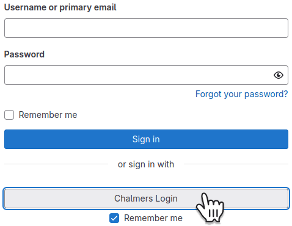
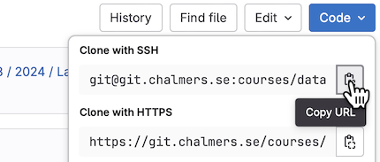
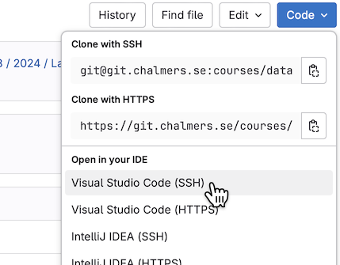
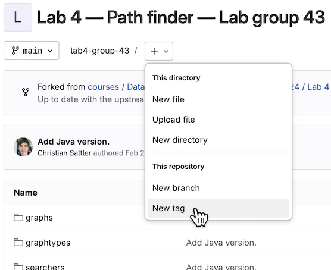
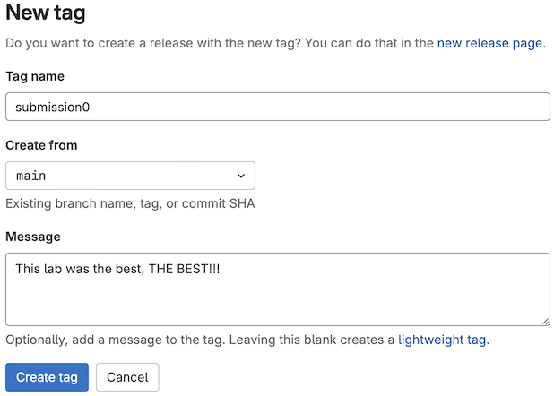
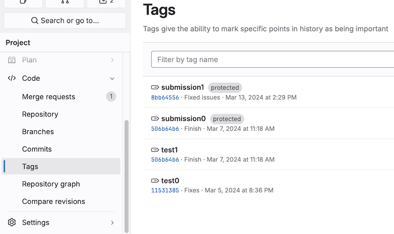

# Working with the labs on Chalmers GitLab

_This document is based on one from the [Data structures and algorithms course](https://chalmersgu-data-structure-courses.github.io/general-course-information/chalmers-gitlab.html)._

## Getting started

[Chalmers GitLab](https://git.chalmers.se/dashboard/projects) (git.chalmers.se) is a service to host Git projects within Chalmers.
To sign in, use **Chalmers Login** (ignore the username/password fields):

You will see all your current projects.
If a lab project is missing, it could be because:

- the lab has not yet been published,
- an invitation was sent to your Chalmers student address, but you have not yet accepted it,
- the lab is done in groups and you have not [joined a lab group](lab-info.md#joining-a-group).

If you still do not see the project after refreshing 5 minutes later, our systems are down.
Let us know!

### Configuring your account

GitLab will notify you about new lab projects and gradings of your submissions via your Chalmers student address.
You can change this by [adding an email address](https://git.chalmers.se/-/profile/emails) and then setting this as the [notification email](https://git.chalmers.se/-/profile/notifications).
**Make sure to configure an email address you actually check.**

[Set your name](https://git.chalmers.se/-/user_settings/profile) and, if you wish, a profile picture.

### Setting up SSH and Git for Chalmers GitLab

Follow our [dedicated tutorial](setup-ssh-and-git.md) to **set up SSH and Git** on your computer and **configure an SSH key** on Chalmers GitLab.

## Setting up a lab

For each lab assignment, we add you as a developer to a project on Chalmers GitLab.
Scrolling down past the file listing, you will see the lab description (this is the file `README.md`, written in Markdown).
You can use this project as you see fit (issues, merge requests, etc.), but mainly it consists of a **git repository**.
For group projects, you can choose how to collaborate: together on one computer or everyone using their own computer and using git to synchronize changes.

### Structuring your repositories

You should take some time to organise the files and folders on your computer.
How you do this is up to you, as long as it works for you.
One possibility is to have a generic "school" folder, which you can divide into your separate courses.
Let us assume that you have created a folder `...\school\data-structures\` where you will put all your labs.

### Cloning your lab

First you have to "clone" the lab repository to your computer – you only have to do this once (per lab).
Here is how to do it using a terminal:

1. Go to the lab repository in your browswer.
    In the top there is a menu, click on *Code*:

    

    Copy the SSH URL by clicking the marked button.

2. Navigate to your personal data structures folder (as described above): `cd ...\school\data-structures`

3. [Clone with SSH](https://git.chalmers.se/help/topics/git/clone.md#clone-with-ssh):
    Run `git clone <pasted SSH URL>` with the SSH URL you copied.

If you are using [VSCode](https://git.chalmers.se/help/topics/git/clone.md#clone-and-open-in-visual-studio-code) or [IntelliJ](https://git.chalmers.se/help/topics/git/clone.md#clone-and-open-in-intellij-idea), you can also clone directly from the GitLab project page:

**Note**:
If you use the Chalmers lab computers, you may experience a problem with git cloning.
Read more about that in our [SSH guide](setup-ssh-and-git.md#install-git).

## Working on a lab

Each lab comes with specific instructions on what you should implement and what questions you should answer (in `answers.txt`).
Please do not change the signatures or behaviour of pre-existing methods unless instruncted as it will make your submission harder for us to test and grade.
Of course, you are allowed to add things that do not affect the existing functionality (new variables, functions, methods, classes, files, and, most importantly, comments).

### Using git

To interact with the provided git repository, you have several options:

- Using a terminal.
  Each time you want to do some work in your local copy:
  - `git pull` to [pull](https://git.chalmers.se/help/topics/git/commands.md#git-pull) the latest changes other group members might have done,
  - `git add -u` and `git commit` to [add and commit](https://git.chalmers.se/help/topics/git/commit.md) your own changes,
  - `git push` to [push](https://git.chalmers.se/help/topics/git/commit.md#send-changes-to-gitlab) to GitLab.

  For a summary of useful commands, see the [git cheatsheet](https://about.gitlab.com/images/press/git-cheat-sheet.pdf).

- If you use an IDE such as VSCode, IntelliJ, or Eclipse, it comes with built-in git integration.
  For example, in VSCode, if you open a window in your lab folder it should recognise automatically that the folder is a git repository.

To simplify things, we suggest you only use the default branch (called **main**) and do not create extra branches.
Then you will not have to interact with the branching functionality of git.

## Submitting a lab

We use the **tags** feature of git for lab submission.
When you are ready to submit, go to your project page on GitLab and create a tag:

The name of a **submission tag** must start with `submission` (make sure to spell correctly).
If you want to be nice, add a number (0, 1, 2, …) to indicate your submission attempt.
Example:

You can write a submission comment in the message field.

Once you have created a submission tag, you cannot change it: it serves as your proof of submission.
You can still push new commits to the repository, but this will not change the tagged version of your code (the commit the tag points to).
Therefore, make sure to tag exactly the version you mean to hand in (be extra careful if you work with multiple branches).

You can override your submission by creating a new submission.
This is useful if forgot to push some commits or accidentally put the tag in the wrong place.
For example, if `submission0` ended up on the wrong commit, put `submission1` on the right one.
We will only grade the latest submission.

**Note**:
The tag must live in the Chalmers GitLab repository, not just your local git clone.
If you create the tag locally and then push, make sure to **push tags** (in the terminal, this is `git push --tags`).

You can check your submission by clicking on ***Code → Tags*** in the Project menu on the left.
The submission tag(s) should be highlighted as protected:

### Getting feedback

After you submit a lab, we create a special **grading merge request** for your submission.
There you can see the grading status of all your submissions.
The graders will give their feedback by commenting in this merge request.
You should be notified by [email](#configuring-your-account) of any updates.

Please use the **discussion thread** in the merge request to respond to the feedback, ask for clarifications, or complain about the grading.
Your grader will respond.

If you did not pass in the first grading and wish to resubmit, create another submission tag (e.g., `submission1`).
