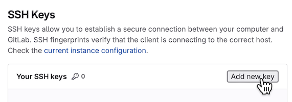
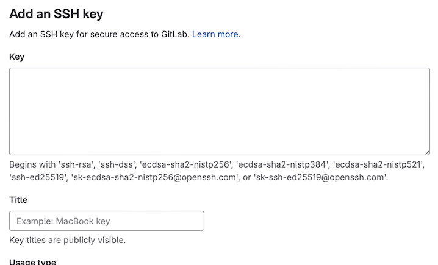

# Setting up SSH and Git for Chalmers GitLab

Here are instructions on how to set up SSH and Git for GitLab.
This is something you should only have to do once; after that you will be able to work smoothly with your laborations.

_This document is based on one from the [Data structures and algorithms course](https://chalmersgu-data-structure-courses.github.io/general-course-information/setup-ssh-and-git.html)._

## The terminal

This guide requires you do to run commands in the terminal.
Here is how open it:

- Windows: start the program called "PowerShell"
- Mac: start the program called "Terminal"
- Linux: depends on the distribution, but if you are a Linux user you should already know it 🤓

## Set up an SSH key

You will use Git to synchronise your local work with the lab project on Chalmers GitLab.
For this, you need an SSH key.

1. Start the terminal.

2. If you have not generated an SSH key before:
    Run `ssh-keygen` in the terminal, leaving all input prompts empty (including empty password).
    It should print the path to your public key.
    Look for something like:

    ```plain
    Your public key has been saved in C:\Users\<username>\.ssh\id_<something>.pub
    ```

    (on Mac/Linux it should be `/<...>/.ssh/id_<something>.pub` instead).

3. Go to the `.ssh` directory menioned above and view the contents of the text file `id_<something>.pub`.
    In the terminal, you can do this with `cd; cd .ssh` and then `cat id_<something>.pub` to print the file.
    It should look something like this (the initial part may differ depending on settings):

    ```sh
    ssh-ed25519 ...long-string-of-numbers-and-characters... user@computer
    ```

4. Go to [SSH Keys](https://git.chalmers.se/-/user_settings/ssh_keys) on Chalmers GitLab and click on ***Add new key***:

    

5. Copy the contents of the file from step 3 into the ***key*** textbox:

    

    Give your key a title.
    We recommend you remove the expiration date.
    Click ***Add key*** to save.

6. Check your setup by running `ssh -T git@git.chalmers.se`.
    You may be prompted to confirm the authenticity of the host (just answer "yes").
    The command should then print a welcome sentence:

    ```plain
    Welcome to GitLab, @<username>!
    ```

    If this does not work, most likely your key is in a location different from what SSH expects.
    Run the same command with the option `-v` and look for "identify file" to find out.

Here are [more detailed instructions](https://git.chalmers.se/help/user/ssh.md).
If you have any problems, ask a teaching assistant during lab supervision or online in the discussion channel of your course.

## Install Git

[Git](https://en.wikipedia.org/wiki/Git) is the industry standard for version control and collaborative software development.
It will pay off to [become familiar](https://git.chalmers.se/help/tutorials/learn_git.md) with it!
The student union also has a [good introduction to Git](https://data101.dtek.se/beginner/git/index.html).

Check if you have it installed by running `git --version`; if it does not print an error, you have already it.
Otherwise, there are instructions for how to [install it on your computer](https://git-scm.com/downloads/).

### Set up your name and email

Set up your name and Chalmers/GU email:

```sh
git config --global user.name "Your Name"
git config --global user.email "your.email@example.com"
```

Git will put this information into every commit you make to let other project members know who made it.

### Problems with git-cloning?

**Note**:
If you use the Chalmers lab computers, you may experience a problem with git cloning.
This is due to the following:

- `ssh-keygen` puts the key in your user folder on the C drive (in `C:\...\.ssh\`).
- `git` looks for your key in your Z drive (in `Z:\.ssh\`).

To solve this, just copy over the whole `.ssh` directory from your user folder on the C drive to the Z drive.
